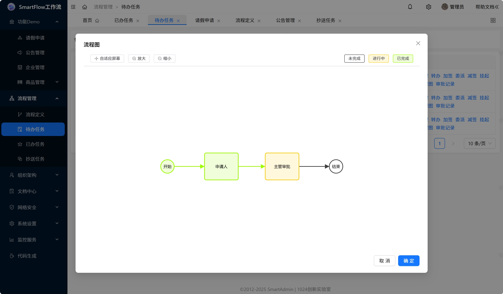

### **SmartFlow**

**SmartFlow** 基于SmartAdmin和Dromara Warm-Flow工作流开源项目，实现了流程设计、流程实例、流程审批、流程监控等功能。

### **技术体系**

- 前端：JavaScript + Vue3 + Vite5 + Pinia + Ant Design Vue 4.X
- 移动端：uniapp (vue3版本) + uni-ui + （同时支持APP、小程序、H5）
- 后端：Java17 + SpringBoot3 + Sa Token + Mybatis-plus + 多种数据库

### **更新历史**
 - 2025-06-01：v3.0.1 更新 Warm-Flow升级到1.7.3，增加请假流程示例，支持移动端工作流。

### **系统截图**

### **感谢项目**
- **SmartAdmin(https://smartadmin.vip/)** 基于SpringBoot2/3+Sa-Token+Mybatis-Plus 和 Vue3+Ant Design Vue+Uni-App+Uni-UI，并以 **「高质量代码」为核心，「简洁、高效、安全」**的快速开发平台。
- **Dromara Warm-Flow(https://warm-flow.dromara.org/)** 是一款国产开源工作流引擎，以​​轻量简洁​​（仅7张核心表）和​​高扩展性​​为核心优势，支持通过JAR包快速集成流程设计器，提供​​全场景审批功能​​（包括会签、转办、委派等20+操作）和​​动态规则引擎​​（如条件表达式、办理人变量表达式），内置​​可视化流程图​​（支持节点颜色/文字自定义）并兼容多ORM框架及数据库。
- **hh-vue(https://gitee.com/min290/hh-vue)** 基于ruoyi-vue原版，集成自研Warm-Flow工作流。
- **RuoYi-Vue-Plus(https://gitee.com/dromara/RuoYi-Vue-Plus)** 多租户后台管理系统 重写RuoYi-Vue所有功能 集成 Sa-Token、Mybatis-Plus、Flowable、SpringDoc、Hutool、OSS 定期同步

### **严正声明**
**SmartFlow**在实现中参考学习了hh-vue项目和RuoYi-Vue-Plus项目的实现方案，感谢SmartAdmin作者@卓大、Warm-Flow和hh-vue作者@晓华、RuoYi-Vue-Plus作者@疯狂的狮子Li。其中涉及的代码版权归原作者所有。